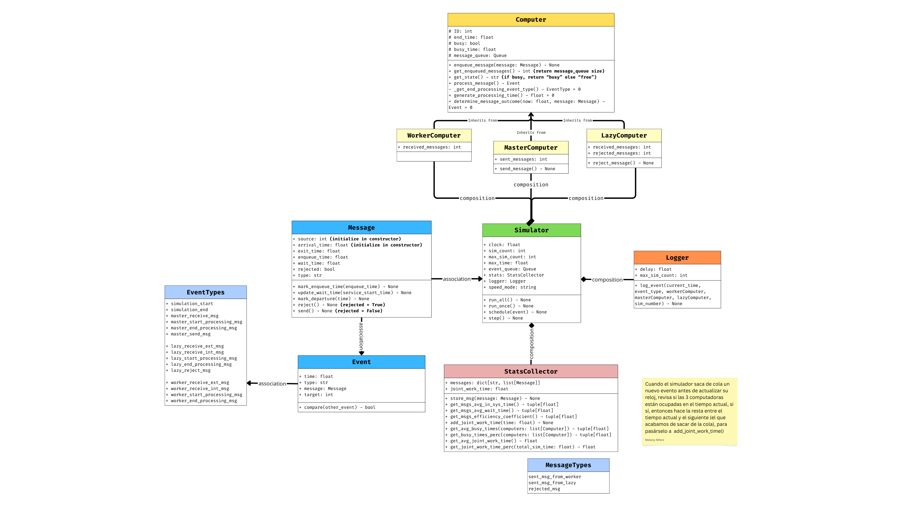

# Design Documentation

**University of Costa Rica – School of Computer Science and Informatics**  
**Course:** CI-0130 Modeling and Optimization Methods  
**Project:** Simulation of a Message Processing System  
**Year:** 2025  
**Authors:** 
- Randall Araya C30569
- Samir Caro C31666
- Evan Chen C32200
- Melany Alfaro C30208

---

## 📑 Table of Contents
- [Design Documentation](#design-documentation)
  - [📑 Table of Contents](#-table-of-contents)
  - [🧩 Introduction](#-introduction)
  - [🧭 Class Diagram](#-class-diagram)
  - [⚙️ Event-Driven Simulation Flow](#️-event-driven-simulation-flow)
    - [High-Level Overview](#high-level-overview)
    - [Simplified Pseudocode](#simplified-pseudocode)
      - [📝 Pseudocode Explanation](#-pseudocode-explanation)
  - [💡 Design Decisions](#-design-decisions)

---

## 🧩 Introduction
This document describes the design and structure of the **Discrete Event Simulation Project**.  
It outlines the architecture, major components, and how events are processed within the system.

## 🧭 Class Diagram
The following diagram illustrates the relationships between main components:



> *Figure 1. Class diagram of the discrete event simulation system.*

---
## ⚙️ Event-Driven Simulation Flow

The simulation runs on an event-driven cycle.  
Each event modifies the system state and may generate new events, which are scheduled back into the event queue.

### High-Level Overview

1. The simulator initializes the system and schedules an initial `SIMULATION_START` event.
2. Events are kept in a **min-heap priority queue**, sorted by timestamp.
3. On each cycle:
   - The earliest event is extracted.
   - The simulation clock jumps to that event’s time.
   - A handler processes the event and schedules future events as needed.
4. The simulation ends when:
   - There are no more events, or  
   - The time horizon is reached (`SIMULATION_END`).

---

### Simplified Pseudocode

> The complete pseudocode is available in  
> 👉 **`simulator_clean.pseudo`**

```
CLASS Simulator:

  INIT:
      initialize simulation parameters
      prepare event handler mappings

  RUN:
      FOR each simulation run:
          reset simulation state
          schedule SIMULATION_START

          WHILE event queue not empty:
              process_next_event()
          END WHILE
      END FOR


  process_next_event:
      event ← earliest event in queue
      clock ← event.time

      IF event.type == SIMULATION_START:
          schedule external arrivals
          RETURN

      IF event.type == SIMULATION_END:
          RETURN

      handle_event(event)

      log event

      IF clock >= max_time:
          schedule SIMULATION_END


  handle_event(event):
      IF event has direct handler:
          call it
      ELSE IF event is EXTERNAL_ARRIVAL:
          enqueue message
          if target idle: schedule processing
          schedule next external arrival
      ELSE IF event is PROCESS_START:
          process message and schedule outcome
      ELSE IF event is PROCESS_END:
          compute outcome and schedule next
      ELSE IF event is INTERNAL_ARRIVAL:
          enqueue message
          if target idle: schedule processing
      ELSE:
          error: unknown event

  -- event generation is delegated to computers or external arrival generators
```

#### 📝 Pseudocode Explanation

The pseudocode describes the core routine of the discrete-event simulator.  
The `RUN` phase iterates over the number of requested simulation runs, resetting the state and scheduling an initial `SIMULATION_START` event.  

During each run, the simulator repeatedly extracts the earliest event from a **priority queue**, advancing the virtual clock to that event’s timestamp. Depending on the event type, the simulator either handles startup logic, delegates message processing, schedules new events, or terminates the current run.  

The `handle_event` procedure acts as a dispatcher. It checks whether the event has a direct handler (e.g., master send, lazy reject); otherwise, it categorizes it into one of several event families:  
- **EXTERNAL_ARRIVAL:** enqueue message, potentially start processing, and schedule the next arrival.  
- **PROCESS_START / PROCESS_END:** begin processing or complete processing and schedule follow-up logic.  
- **INTERNAL_ARRIVAL:** enqueue messages generated within the system and schedule processing if idle.  

When the simulated clock exceeds the configured time horizon, a `SIMULATION_END` event is scheduled, which causes the loop to finish.

This approach reflects the main principles of discrete-event simulation:  
-  The system clock jumps from one meaningful timestamp to the next, and  
- Events dynamically generate future events, enabling system evolution over time.  

---


## 💡 Design Decisions
Some of the key design choices include:
- Using **object-oriented principles** to encapsulate simulation logic.  
- Employing **discrete event scheduling** to model time-based behavior accurately.  
- Ensuring **modular structure** to allow future expansion or replacement of distribution models.  
- Supporting **different runtime modes** (slow, fast with messages, fast silent).

---


© 2025 University of Costa Rica. All rights reserved.  
Licensed under CC BY 4.0.